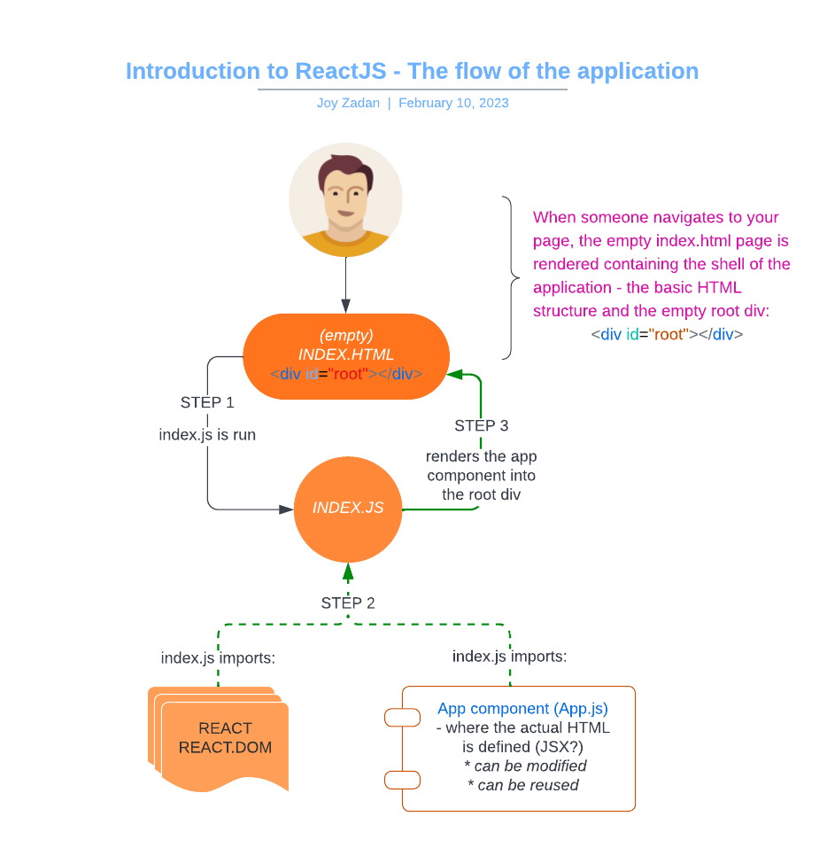

# React Project Example, an introduction to React


---
# **REACT ESSENTIALS**
## **About ReactJS**
ReactJS - more commonly just called React - is a powerful, open source JavaScript library used to create fast and interactive user interfaces. It is developed and maintained by Facebook, and used by over 1.7 million live websites as of 2020.

This makes React the most popular of the three major JavaScript frameworks and libraries, beating out both the VueJS library and the AngularJS framework.

Due to its scalability and maintainability, React is used by many of the largest and most well known websites in the world, some serving billions of users, including Facebook, Netflix, Twitter, Instagram and The New York Times.

At the core of every React application are components which are small JavaScript files, usually written in a special JavaScript syntax called JSX.

Each component on its own is like a miniature web application. Components have the ability to make HTTP requests, communicate with servers and APIs, communicate with one another, and update themselves in response to user interactions.

Multiple components are composed together to create a user interface, where each component makes up a small part of the UI, like a navigation menu, an individual tweet or post, a button, or a form.

Individual components are completely independent of one another, and this means that individual parts of the user interface can update independently and in real time, without refreshing the page.

Components are also reusable, which means you only have to write the code once, and it can then be reused over and over throughout your application, or even reused in a completely different application.

All these features make React scalable, easy to maintain and incredibly flexible. As a front end library, the React philosophy is to *do one thing, and do it really well.*

React is responsible for the way the application looks and feels. By coupling it with a full stack framework like Django, or a back end server environment like NodeJS, you can build powerful full stack applications with interactive, asynchronous front ends capable of being completely disconnected and independent from the back end.

In the upcoming series of videos, let's learn how to build React applications step by step, and how to integrate them into the full stack ecosystem.

To view the available scripts, go to [react-example/README.md](./react-example/README.md)

---
### **The structure of a React project**

First, to copy the repo [Code Institute's React Example Project template](https://github.com/Code-Institute-Org/ci-react-core-react-project-example), click the button *Use this template*, name and create your own repo and then click the green *GitPod*  button to use the template.

The entire project is containedd within the **react-example** folder. Change directories into that folder using the ``cd react-example/` command, run the command `npm start` to start the app. This will start the app in the preview window if you want to see what the running app looks like.

* **package.json** file. <br/>
Inside this is a JS object with a number of properties defining the configuration for thee app. For example. it's got a name and version number for the app itself and a list of the dependencies the app needs to run. It also has some pre-made scripts that can be used to start, stop and test the app. This file is highly configurable and can be generated automatically by some software or you can create it yourself. You'll learn more how to finesse this file as your React apps become more complex. For now, you can think of this as a sort of configuration file for your React app.

* **index.html** file
This is the file that will be served when someone visits your app. There's only one key piece of code you need to know about this file and that's the
    ```html
    <div id="root"></div>
    ```
    This div is where all your react components will be rendered at runtime in order to create the user interface.
    There's also a noscript tag just above just above that div
    ```jsvascript
    <noscript>You need to enable JavaScript to run this app.</noscript>
    ```
    which will render the message about enabling JS to run the app if the user's browser doesn't support JavaScript.

* **src** folder
    We will only focus on some of the files here.
    * **App.js** is the react component that renders the content you see in the preview window. In this case, **App.js defines a function called App, `function App()` and this the actual React Component.** The function returns a strange looking combination of HTML and JavaScript and this language is called **JSX** which we'll be learning throughout this module. At the bottom of the file, the function is exported, `export default App;` allowing it to be imported into other files on the project so that it can be reused as needed.

    * **index.js** is the JavaScript file that gets run when you first load the app. Inside it is where the magic happens. First, there are some imports including **React**, **ReactDom**, some CSS, and the app component from App.js.
        ```javascript
        import React from 'react';
        import ReactDOM from `react-dom`;
        import './index.css';
        import App from `./App`;
        import reportWebVitals from `./reportWebVitals`;
        ```
        Then, `ReactDOM.render` is called in order to render the App component in that root div with the ID of "root" in index.html (see index.html above).
            `document.getElementById('root')`

    * **App.css**<br/>
        App.css provides styling for the app.js component.

    * **index.css**<br/>
        index.css provides styling for the index.html page.

        It would technically be fine to put all this CSS in one file, but generally React developers like to separate out their component CSS so that if they reuse the component, the CSS comes with it.

---
### **The flow of the application**

* When someone navigates to your page, the *empty* **index.html** is rendered containing the shell of the application, the basic HTML structure and the empty root div.

* Then **index.js** is run, which imports React, ReactDOM and the App component and renders the App component into the root div.
    ```javascript
    React.DOM.render(
        <React.StrictMode>
            <App />
        </React.StrictMode>,
        document.getElementById('root')
    );
    ```

* The **app component** itself is where the actual HTML you see in the preview window is defined, and it can be modified or reused as required.
    Most React apps have lots of little components like App.js and **each component renders a specific part of the UI**. Together, they make up the entire user interface and can provide all sorts of interactivity.

Recap: index.html contains basic page structure and the empty root div, the root div ends up with the App component rendered into it, and that is done when index.js is run. This is the basic flow of any React application. The configuration for how they work together is managed with **package.json**.



---
Next: See **Introduction to JSX**